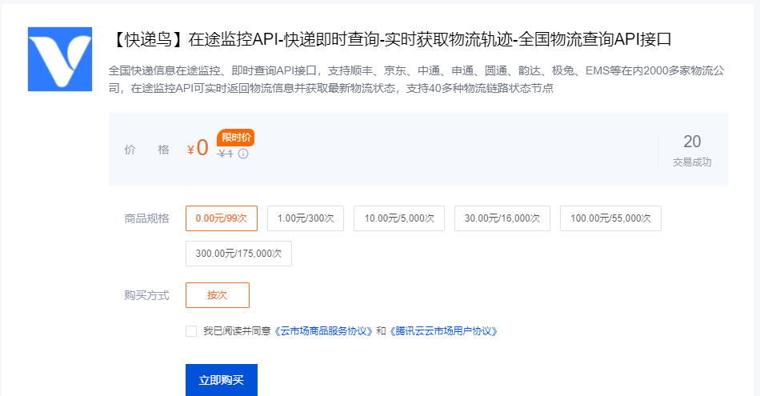

### 如何使用

#### 1、配置数据源（可选）：演示智能问数，如果没有可用数据源，需要将pom的mybatis相关依赖注释

#### 2、直接启动项目即可

#### 3、在智能体配置MCP，传输方式选择SSE，地址填写http://localhost:9001/mcp

### 最佳实践

#### 1、选择deepseek-v3、gpt-4o-mini或者claude大模型

#### 2、上下文最好只配置为1~3条

### 注意事项

> 为什么有这么多限制？因为MCP的本质是调用现成的工具完成工作，因此很多操作都需要你有现成的工具或服务来支持，MCP只是一个中间人，帮你把自然语言转化为实际操作。

#### 1、如需查询快递，需要配置快递鸟的secretId和secretKey，[地址访问](https://market.cloud.tencent.com/products/43366)

  
目前，我只在代码里配置了顺丰、圆通、中通、申通、韵达、百世的快递公司编号，如需添加其他公司编号，请访问 [快递鸟文档第9页](https://market-isv-1258344699.cos.ap-shanghai.myqcloud.com/files/202508/18040179-2955-448f-9c0f-6d0c0f088624/%E5%BF%AB%E9%80%92%E9%B8%9F%E5%9C%A8%E9%80%94%E7%9B%91%E6%8E%A7API%E6%8E%A5%E5%8F%A3%E4%BD%BF%E7%94%A8%E8%AF%B4%E6%98%8E.pdf)

#### 2、打开游戏、下载游戏需要用户电脑里安装stream，需要我通过stream接口获取用户游戏库的数据，故本代码移除

#### 3、智能问数，以使用我自己的CSGO的数据，用户可以自行改造，演示用的SQL脚本已给出

#### 4、打开音乐，需要在WindowService的music_path配置音乐文件的位置（总不能让AI扫盘吧），如果包含网易云的vip音乐，还需要配置wyy_exe，内容为本地网易云可执行文件的路径的路径

#### 5、爬取视频需要用户本地安装you-get和ffmpeg。

#### 6、发送邮件需要邮件开启SMTP服务，发送手机通知需要手机上安装HAMIBOT并配置

#### 7、工作流比较庞大，这里采用调用其他系统提供的工作流接口，供AI去操作它们系统的工作流，本代码未体现

#### 8、PPT的MCP：https://open.docmee.cn/api/mcp/sse?token=

#### 9、关于让AI查询张祺介绍，这里是通过RAG去查询，大家就不用配置了，因为我没有维护我自己的数据~

#### 10、AI文档审查，需要有go环境支持，参考CodeService代码上的注释配置

#### 11、关于文档审核，不在本工程体现，在rag模块

#### 12、让AI安装java部署之类的，不在本工程体现，在异步mcp-async-server模块

#### 13、让AI玩红警，参考后续博客使用

#### 14、AI控制视频播放器，不在本工程体现，在前端工程

### 系统提示词

不需要配置

### 示例提示词

> 本代码仅供演示使用，示例提示词受大模型影响，展示形式或者调用可能不能按照预期工作。
> 大家可以参照代码进行二次开发，以完成一些对你有用的功能

#### 1、查询快递

- AI，帮我查个快递吧
- AI，帮我查个韵达快递吧
- AI，帮我查个韵达快递吧，单号是xxxx

#### 2、预测比特币走向

- AI，帮我预测一下比特币的走向
- AI，比特币会涨吗？

#### 3、让AI打开网站，关闭游戏进程

- AI，帮我打开哔哩哔哩
- AI，帮我打开百度搜索MCP
- AI，帮我关闭DOTA2（假设DOTA2卡死了）

#### 4、让AI打开音乐

- AI，帮我播放一首歌
- AI，我想听烟花易冷
- AI，帮我播放一首周杰伦的的歌曲
- AI，在网页上帮我打开音乐-孤勇者

#### 5、让AI爬取CSDN博客

- AI，帮我爬取CSDN博客
- AI，帮我爬取CSDN博客，将爬取的内容放在D盘的ai文件夹里
- AI，帮我爬取CSDN博客，将爬取的内容放在D盘的ai文件夹里，链接是xxxxxx

#### 6、AI与工作流

- AI，帮我发起请假流程
- AI，帮我请一天病假
- AI，帮我请一天病假，下一个节点是审批人是admin
- AI，帮我请3天假，理由是旅游，下一个节点是审批人是admin
- AI，给下一个节点审批人发送邮件通知
- AI，给admin发送邮件通知

#### 7、AI生成PPT

- AI，生成关于OpenAI介绍的PPT

#### 8、AI审查代码

- AI，审查D盘code文件里的代码
